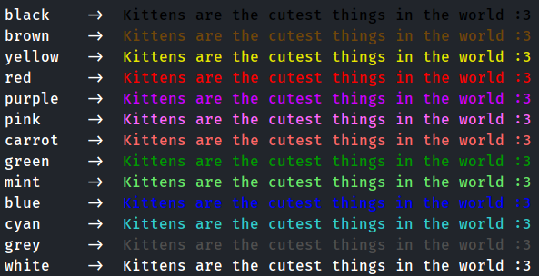
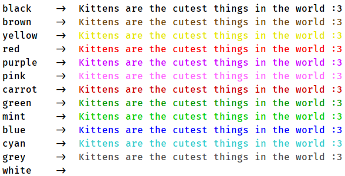

This package alows you to paint your terminal


**Dark theme:**



**Light theme:**




How to use it
===
So, first of all you need to install the package:

```bash
python -m pip install terminal_colorizer
```

Then import functions you need:


```python
from terminal_colorizer import red, blue, mint
```

and use it in your output:


```python
print(mint('kittens are so cute'))
```
You can use multiple argumets:

```python
print(red('this', 'is', 'multiple', 'agrs'))
```

or same with named argument *sep*:

```python
print(red('this', 'is', 'multiple', 'agrs', sep='\n'))
```

It works the same way as print's *sep*

As an argument functions take any object which implements ```__str__()``` method

This also works:

```python
print(blue(list(range(0, 10))))
```
or:

```python
print(blue(*list(range(0, 10))))
```

If you want to disable output from painting you need to use controller:

```python
from terminal_colorizer import controller as tcc

tcc.turn_off()
```
If you want to turn on painting again:

```python
tcc.turn_on()
```


## WARNING: Colorizer does NOT work with windows console
